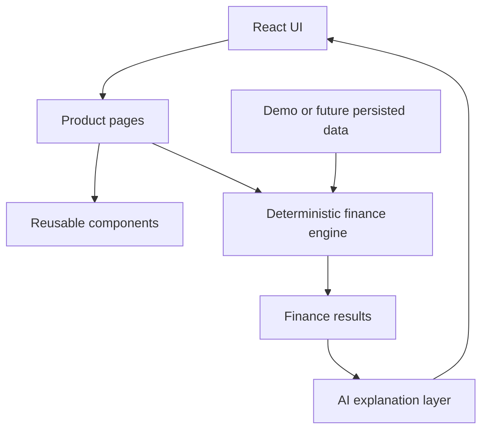
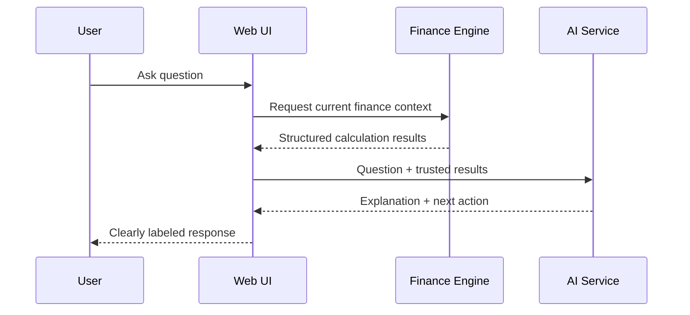

# Architecture

## Product flow

## Responsibilities

- App shell: navigation, auth/onboarding state, modals and notifications.
- Product pages: financial workflows and decision-oriented views.
- Components: KPI cards, charts, tables, badges, buttons, alerts, forms and AI messages.
- Finance engine: trusted deterministic formulas.
- Data layer: demo records now; API/database later.
- AI layer: explanation only, using trusted calculation results.

## AI safety boundary

## Production evolution

1. Authenticated API
2. Persistent database
3. Server-side finance engine
4. AI gateway receiving structured results only
5. Audit logs for financial mutations and calculations
6. Server-side authorization and rate limiting

## Design tokens

| Token | Value |
|---|---|
| Background | #070709 |
| Surface | #111216 |
| Surface 2 | #181A20 |
| Border | #3C414C |
| Text | #D9D8DC |
| Muted | #858995 |
| Primary | #6065FA |
| Accent | #585999 |
| Warning | #D75A35 |

The interface avoids decorative gradients, excessive glassmorphism, and unnecessary motion.
