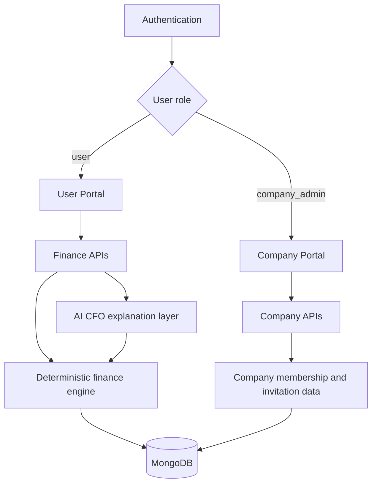
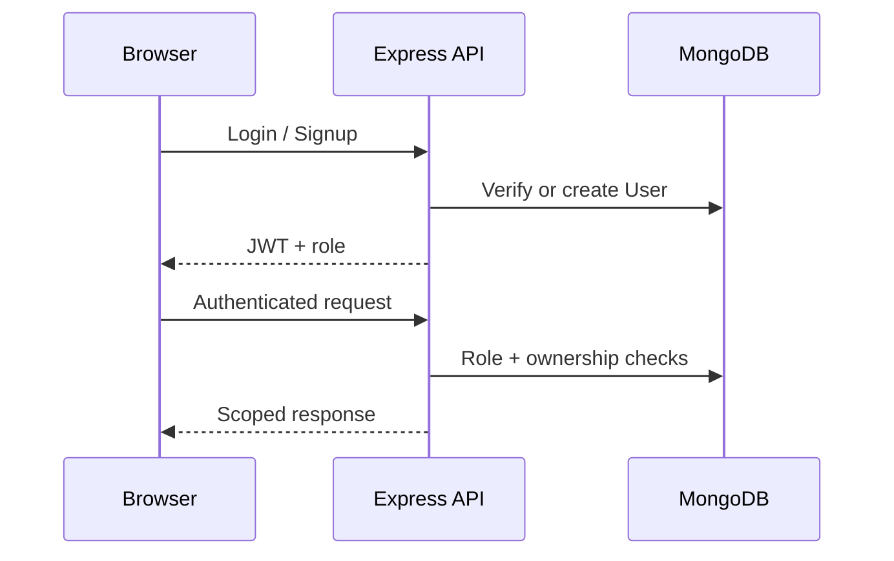
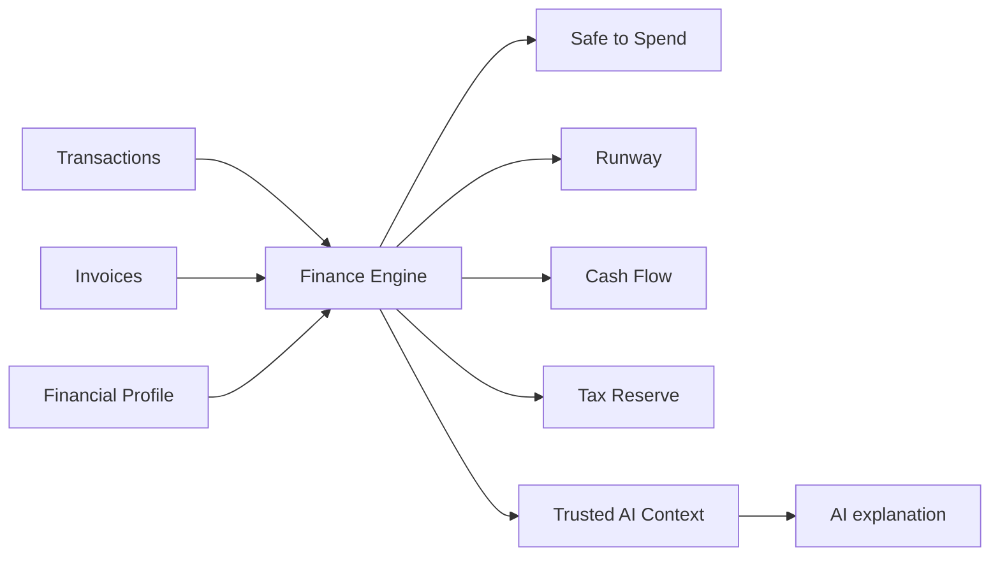

# Architecture

## Two-sided SaaS structure

## User Portal

The user side is private to the signed-in user.

- Dashboard / Safe to Spend
- Transactions
- Invoices
- Cash Flow
- Tax Reserve
- Runway
- AI CFO
- Personal settings

All financial queries are scoped by userId.

## Company Portal

The company side is operational rather than financial.

- Company overview
- User/team management
- Invitation management
- Seat and onboarding metrics
- Company settings

Company admins cannot call the user finance APIs because those routes require the user role.

## Authentication

## Financial source of truth

The AI layer explains deterministic results. It does not own critical financial calculations.

## Deployment

The React/Vite application is deployed as the frontend while /api/* is handled by the Vercel Node function in api/[...path].js. Local development uses server/index.js.

MongoDB is the persistent data store. Production requires MONGODB_URI, JWT_SECRET, JWT_EXPIRES_IN, and CLIENT_ORIGIN.

## UI direction

The user portal and company portal share the reference-inspired editorial system: warm light canvas, white rounded cards, large typography, compact pills, and generous whitespace. The information architecture differs between the two roles.
