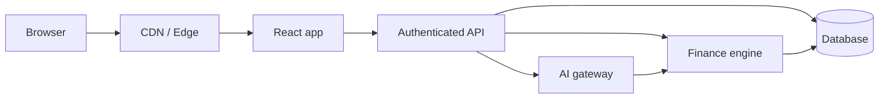

# Deployment

## Static MVP

Build the frontend:

```bash
npm ci
npm run build
```

Deploy `dist` to a static host such as [Vercel](https://vercel.com/), [Netlify](https://www.netlify.com/), or [Cloudflare Pages](https://pages.cloudflare.com/).

## Production architecture



Never place production database credentials or AI provider secrets in frontend code.

## Security checklist

- HTTPS
- Secure session handling
- Password hashing
- Server-side authorization
- Rate limiting
- Input validation
- Financial mutation audit logs
- Secret management
- No sensitive financial data in browser logs
